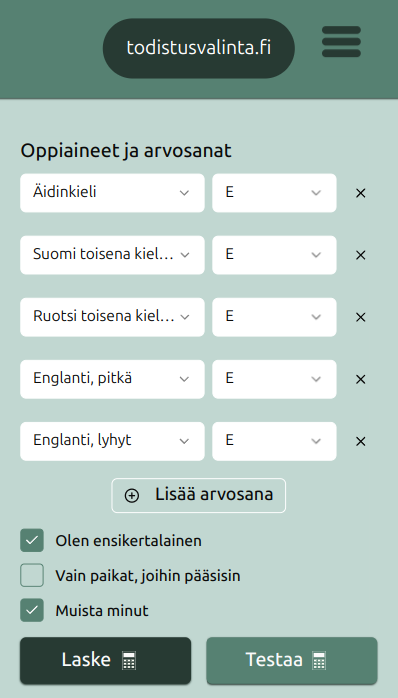

# Todistusvalinta.fi website
The aim for this project was to produce a new UI for todistusvalinta.fi -data. New UI would allow more robust development in the future. 



## Technologies
- Typescript
- Zod
- React Vite
- Tailwind
- Shadcn
- Prettier
- Visual Code Studio
- Git
- Github Actions
- Google Adsense


## Features

### Calculator for Matriculation Examination
In finland you obtain a Matriculation Examination degree from high-school. With this degree you can apply for universities all around the country. With the calculator user can calculate his possibilities to get into university of his or her choice. User gives his examination data to the calculator, which obtains data from API. Calculation is made in the API completely.

### Calculator for Vocational Degree 
You can also apply to certain vocational schools based on a degree from basic-level Vocational school. Calculator helps user to form his evaluations and calculate the result.

### Ethical Use of User Information
One of the features is the cookie banner and all the documents relating user information. User is informed about data collecting and can deny all information collecting from his device.

### Advertise System
In the website you can show ads either your own or using Google Adsense. From custom-made ads some basic data is collected to server-side logfiles.

## Requirements
npm 10.8.2 (Other versions not tested)  
Nodejs 20.18.1 (Other versions not tested)

## Installation
You can of course download the repository by 
```sh
git clone [repository url]
```
API -connection is only allowed from certain domains, so local deployments wont work if you dont also have a local version of the backend API.

Download the neccessary npm packages
```sh
npm i
```

After installation you must define .env.local -file's environment variables to match your need. Then run application and watch for localhost address to start developing.

```sh
npm run dev
```

## Production Deployment 

After installation you must define .env.production -file's environment variables to match your need.

Make the build by issuing
```sh
npm run build 
``` 

Move the `dist` -folder to your webserver's folder to be served as static html files. Make sure that your index.html -file is referenced correctly by your domain.

If you have rights to git and want to push production to `main` production line make a git pull request or push directly to `main` branch. Github Actions will deal with the deployment to todistusvalinta.fi

You can also test the production deployment by making a push to `development` branch

## Environment variables
Here is a list of all environment variables with some examples
- `VITE_API_URL`=http://localhost:3000/graphql
- `VITE_SERVER_URL`=http://localhost:3000
- `VITE_ADSENSE_CLIENT`=a-app-pub-3940256099942544
- `VITE_ADSENSE_SLOT`=9214589741
- `VITE_ENVIRONMENT`=development

Adsense keys work only from certain domains so they don't work from localhost.

## Data folder
The project contains a data -folder for light data that is not updated frequently and is not needed to be transferred to api.

**adsData.ts** contains all data for ads. Ad's pictures must be situated in assets/ads -folder If customer wants to change the ad, it must be changed here and then pushed to main in order to it be changed in the UI.

**titles.ts** has all titles and their respective url-paths listed. If you would like to add more pages or remove some from navigation, modify the list here. 

## Licence 
Copyright (c) 2024 Olli Majaluoma tmi. All rights reserved.