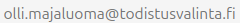

# Yhteistyö todistusvalinta.fi:n kanssa

**Todistusvalinta.fi** on Suomen suosituin korkeakouluja koskeva todistusvalintalaskuri. Palvelua käyttää kuukausittain kymmeniä tuhansia hakijoita, jotka suunnittelevat korkeakouluopintojen aloittamista ja vertailevat eri alojen pisterajoja.  

Tarjoamme yrityksille ja organisaatioille mahdollisuuden tavoittaa kohdennettu ja aktiivinen nuori yleisö – sekä hyödyntää ajantasaista valintapisterajadataa omilla sivustoillaan.

---

## Mainostajille

Todistusvalinta.fi tarjoaa mainospaikkoja ja sisältöyhteistyömahdollisuuksia sivuston eri osioissa.  

Mainonta sopii erityisesti:
- koulutusorganisaatioille ja valmennuskursseille  
- oppimateriaali- ja teknologiayrityksille  
- opiskelijaelämään liittyville palveluille  

Ota yhteyttä, niin räätälöimme sopivan näkyvyyspaketin.

---

## API ja upotettavat työkalut

Haluatko hyödyntää **todistusvalinta.fi:n dataa** omassa palvelussasi?  
Kaikki sivuston pisterajat ja laskentalogiikka ovat saatavilla **rajapinnan (API)** kautta.  

Tarjoamme myös helppokäyttöisen **upotettavan laskurin**, jonka voi lisätä suoraan omalle verkkosivulle – iFrame- tai JavaScript-versiona.  
Laskuri hakee aina ajankohtaiset tiedot suoraan todistusvalinta.fi:n palvelimelta, joten se pysyy automaattisesti ajan tasalla ilman huoltotoimia.

---

## Ota yhteyttä

Laita meille sähköpostia ja kerro ajatuksesi.

Tai täytä yhteydenottolomake alla
